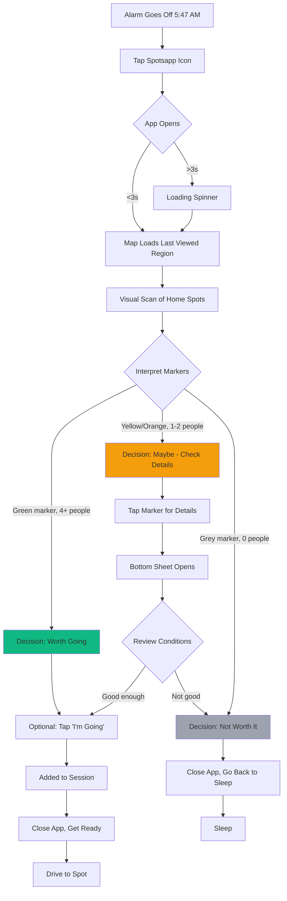
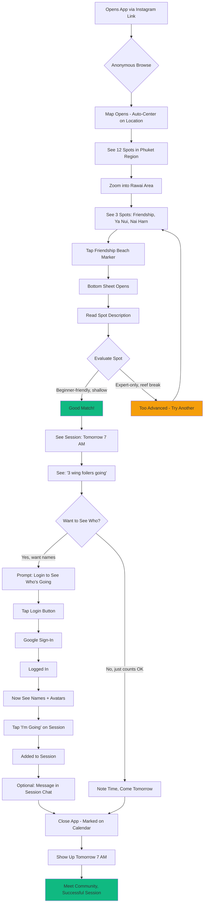
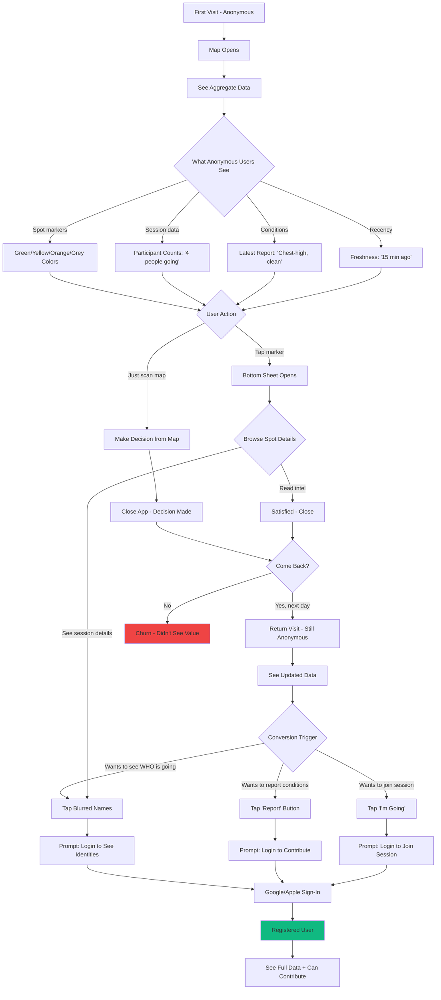
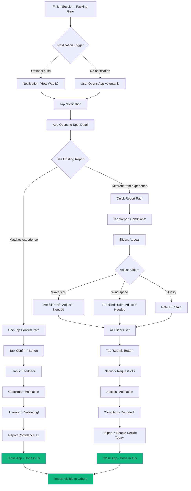
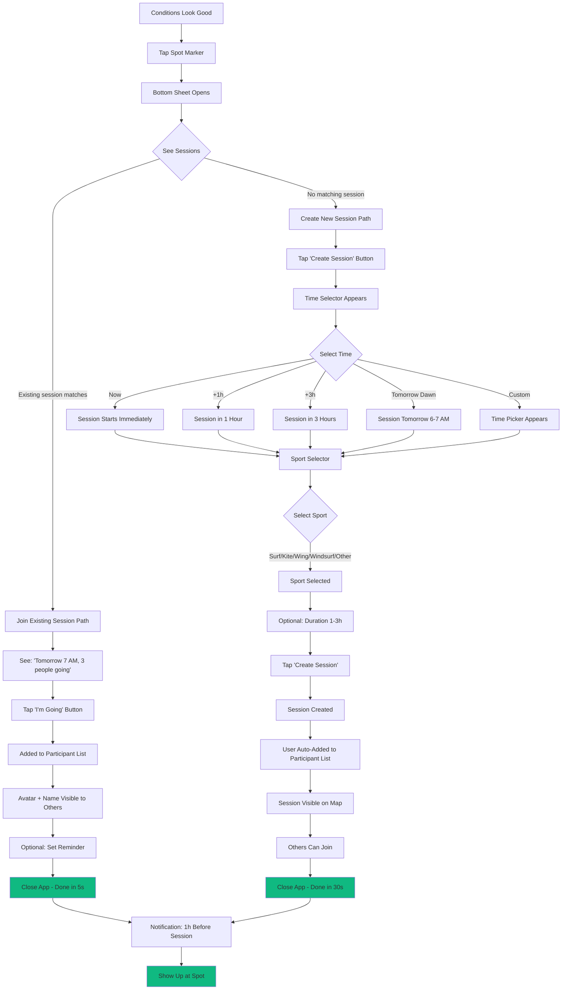

# UX Design Specification - Spotsapp

**Author:** Hemmu
**Date:** 2026-02-20

---

## Executive Summary

### Project Vision

Spotsapp is a map-first coordination utility that replaces chaotic WhatsApp coordination with structured, spatial awareness for water sports communities. Users can see who's going, what conditions are like, and make go/no-go decisions in under 10 seconds—all without sending a single message.

**Core Value Proposition:** One-glance spatial intelligence for session coordination

**Platform Strategy:** Expo-based (React Native) with dual deployment:
- Web access for instant, frictionless discovery
- Expo Go native app for superior map performance and offline capability
- Future app store deployment when traction justifies investment

**Anti-Pattern:** This is NOT a social feed app. No likes, no follows, no engagement mechanics. Pure coordination utility—users open it to make decisions, not to scroll.

### Target Users

**Primary: The Regular Local (Mika)**
- Surfs/foils/kites multiple times per week
- Checks app pre-dawn (5-6 AM) to decide: "Is it worth getting up?"
- Needs: One-glance decision (<10s), see conditions + who's going simultaneously
- Tech usage: One-handed, possibly half-asleep, in dim bedroom lighting
- Success metric: Goes from alarm to decision in <15 seconds total

**Secondary: The Traveling Visitor (Sofia)**
- Arrives in new area with gear but zero local knowledge
- Needs: Discover spots, read local intel (parking, hazards, etiquette), find community
- Wants to see who's planning sessions without awkward "Hi strangers!" WhatsApp messages
- Success metric: Finds suitable spot and joins a session within first day

**Tertiary: The Occasional Participant**
- Checks conditions weekly, goes when conditions align with schedule
- Values community intelligence but not daily engagement
- Success metric: Stays informed without notification overload

**Special: The Newcomer (Anonymous-to-Registered)**
- Heard about app from WhatsApp group, hasn't committed yet
- Needs: See value before registering (anonymous browse)
- Wants: Explore without friction, register when motivated
- Success metric: Converts from browser to registered contributor naturally

### Key Design Challenges

1. **Information Density vs Glanceability**
   - Display conditions, sessions, recency, sport types without overwhelming
   - Support "10-second decision" requirement
   - Work in challenging contexts (bright sunlight, pre-dawn dimness, one-handed)

2. **Map-First Architecture**
   - The map IS the app (no tabs, no separate views)
   - Everything spatial - spots, sessions, conditions all map-based
   - Zoom-density scaling to manage information at different scales

3. **Anonymous → Registered Friction**
   - Show value to anonymous users (aggregated data)
   - Motivate registration (see who's going, not just counts)
   - Zero pressure, natural conversion flow

4. **One-Handed Speed**
   - Report conditions in <15 seconds (slider + submit)
   - One-tap confirm for existing reports (<3 seconds)
   - Works with wet hands, in parking lot, one-handed while holding gear

5. **Cross-Platform Consistency (Web + Native)**
   - Same UX whether accessed via browser or Expo Go
   - Platform-agnostic gestures and interactions
   - Responsive design that works 320px to 2560px

6. **Time-Based Planning**
   - Show "Now" (active) vs "Planned" (future) sessions clearly
   - Time slider for forward planning ("who's going tomorrow morning?")
   - Default to "now to sunset" for today's decision-making

### Design Opportunities

1. **Zero-UI Coordination**
   - Visual scan replaces verbal/text communication
   - Faster than asking "who's going?", more social than "checking forecast"
   - Competitive advantage: Instant spatial intelligence

2. **Recency as First-Class UI**
   - Color-coded freshness (green/yellow/orange/grey) eliminates "when?" question
   - Users trust recent data, dismiss stale data naturally
   - Visual language for data quality

3. **Sport-Aware Inclusivity**
   - Multi-sport by default (surf, wing, kite, SUP, windsurf)
   - Same spot, different perspectives (wind is good for foilers, bad for surfers)
   - Sport icons and filters create inclusive community

4. **Ephemeral by Design**
   - App always feels fresh (no 3-week-old posts)
   - "Now" sessions auto-expire (90min), condition data fades to grey over time
   - Zero maintenance burden - staleness is visual, not administrative

---

## Core User Experience

### Defining Experience: "The One-Glance Decision"

Spotsapp enables decision-making in <10 seconds through spatial intelligence. The core loop:

1. **Launch** → Map opens centered on user location (or last viewed region)
2. **Scan** → Visual sweep reveals conditions + sessions at nearby spots
3. **Decide** → "Worth going?" answered without tapping anything
4. **Act** → Either go to the spot, or close app (decision made)

**Critical Path Metric:** Launch to decision in <10 seconds (stretch: <7 seconds)

This experience replaces:
- WhatsApp: "Anyone going to Kalim?" → 15 minutes of back-and-forth
- Forecast apps: Wind speed/direction numbers → mental calculation → uncertainty
- Hybrid approach: Check forecast + send messages → 20+ minutes, still uncertain

### Platform Strategy: Expo-Based Mobile-First

**Architecture:** React Native (Expo) with dual deployment:
- **Web deployment:** Instant discovery via browser, zero install friction
- **Expo Go deployment:** Native map performance, offline capability, no app store costs
- **Future path:** Standalone app store deployment when user base justifies investment

**Mobile-First Design:**
- Primary viewport: 375×667 (iPhone SE) to 430×932 (iPhone 14 Pro Max)
- Responsive expansion: 320px to 2560px (tablet/desktop secondary)
- Touch targets: Minimum 44×44pt (iOS HIG), prefer 48×48pt
- One-handed reachability: Critical actions in bottom 2/3 of screen

**Performance Targets:**
- Map load: <3 seconds on 4G
- Initial data fetch: <2 seconds
- Decision time: <10 seconds total (from launch)
- Offline mode: Full read access to cached data

### Effortless Interactions

**Zero-Action Intelligence (Passive Value)**

Users gain value without tapping:

1. **Auto-Centering**
   - Map opens to user's current location (first time)
   - Subsequent launches: Last viewed region (persistent state)
   - "Find Me" button available but not required

2. **Zoom-Density Scaling**
   - Far zoom: Cluster markers (heatmap style)
   - Medium zoom: Individual spot markers with aggregate data
   - Close zoom: Full detail (sessions, conditions, profiles)
   - Users navigate naturally; information density adjusts automatically

3. **Recency Visualization**
   - Color-coded freshness visible at all zoom levels
   - Green (0-30min) → Yellow (30-90min) → Orange (90min-3h) → Grey (3h+)
   - No timestamps to read; freshness is immediate visual property

4. **Auto-Expiry**
   - "Now" sessions fade after 90 minutes (no manual cleanup)
   - Condition reports age visually (color progression)
   - App always feels current; stale data self-identifies

**One-Action Contributions (Active Value)**

When users do interact, it's fast:

1. **One-Tap Confirm (3 seconds)**
   - See existing condition report: "Mast-high, clean, wind 15-20kn"
   - Tap "Confirm" → Done
   - Use case: Quick validation while standing in parking lot

2. **Quick Report (15 seconds)**
   - Tap spot marker → "Report" button
   - Slider interface: Wave size, wind speed, quality (1-5 stars)
   - Optional sport-specific fields (swell direction, gust spread)
   - Submit → Done
   - Use case: Post-session contribution while packing gear

3. **Session Planning (30 seconds)**
   - Tap spot marker → "I'm Going" button
   - Select time: "Now" (default), "In 1h", "Tomorrow dawn", "Custom"
   - Optional: Add sport, duration
   - Submit → Visible to registered users
   - Use case: Morning check - commit to session

### Critical Success Moments

**First Launch (Anonymous User)**
- **Context:** Visitor or skeptic exploring before commitment
- **Goal:** Demonstrate value in <30 seconds
- **Flow:**
  1. Map loads with nearby spots visible
  2. See aggregate data (6 surfers going, last report 15min ago)
  3. Tap spot → See aggregated conditions ("Chest-high, clean")
  4. See "Login to see who's going" prompt (gentle conversion nudge)
- **Success Metric:** 40% return within 7 days → 20% register within 14 days

**Dawn Decision (Mika - Regular Local)**
- **Context:** 5:47 AM, alarm just went off, bedroom dark, phone at 40% brightness
- **Goal:** Decide "go/stay" in <10 seconds
- **Flow:**
  1. Launch app (muscle memory)
  2. Map opens to home spots (cached from yesterday)
  3. Visual scan: Surin - green marker, 4 people going. Kalim - grey marker, no sessions
  4. Decision: "Surin is firing, crew is going → I'm going"
  5. Optional: Tap Surin → "I'm Going" (adds self to session)
- **Success Metric:** <10s launch-to-decision, 80% accuracy (report matches reality)

**Newcomer Discovery (Sofia - Traveling Visitor)**
- **Context:** Just arrived in Phuket, has wingfoil gear, zero local knowledge
- **Goal:** Find safe spot with friendly community within first day
- **Flow:**
  1. Open app (heard about it from Instagram)
  2. Map shows 12 spots in Phuket region
  3. Zoom into Rawai area → 3 spots visible
  4. Tap "Friendship Beach" → Read description: "Mellow wind, beginner-friendly, parking at pier"
  5. See session: "Tomorrow 7 AM, 3 wing foilers going"
  6. Register → Join session → Show up tomorrow
- **Success Metric:** 60% of new registrations join a session within 48 hours

**Post-Session Contribution (Any User)**
- **Context:** Just finished session, packing gear in parking lot, hands slightly wet
- **Goal:** Share conditions while memory is fresh (<15 seconds)
- **Flow:**
  1. App open (stayed in background during session)
  2. Spot detail view still visible (or notification: "How was it?")
  3. Tap "Report" → Sliders pre-filled with recent data
  4. Adjust if needed (wave size +1, quality 5 stars)
  5. Tap "Submit" → Done
- **Success Metric:** 35% of session participants report conditions within 2 hours

### Experience Principles

**1. Map-First, Map-Only**
- No tabs, no separate views for "spots" or "sessions"
- Everything spatial: If it's not on the map, it doesn't exist
- Pan/zoom/explore is the primary navigation paradigm

**2. Zero-UI Coordination**
- Visual scan replaces asking "who's going?"
- Markers show attendance without requiring taps
- Coordination happens through observation, not conversation

**3. Recency as First-Class Citizen**
- Freshness is visual property, not metadata
- Color-coding eliminates "when was this?" question
- Stale data self-identifies (grey = ignore)

**4. One-Handed, Eyes-Up Speed**
- Critical actions reachable with thumb (bottom 2/3 of screen)
- Large touch targets (48×48pt minimum)
- Works with wet hands, gloves, in bright sunlight
- Minimal reading required; visual patterns dominate

**5. Progressive Disclosure of Identity**
- Anonymous users see aggregate value (counts, conditions)
- Registered users see identities (who's going, who reported)
- Contributions require registration, but browsing doesn't
- Conversion happens naturally when motivation is intrinsic

**6. Ephemeral by Design**
- "Now" sessions auto-expire (90 minutes)
- Condition reports fade to grey (3 hours)
- No manual deletion, no moderation backlog
- App always feels fresh; staleness is automatic

**7. Cross-Platform Consistency**
- Same UX on web browser and Expo Go native app
- Platform-agnostic interactions (no iOS-only gestures)
- Performance targets apply to both platforms
- Offline capability works everywhere (service worker + native cache)

---

## Desired Emotional Response

### Primary Emotional Goals

**1. Confident and Empowered (Primary)**

Users should feel **certainty in their decisions** without needing validation. The one-glance scan provides complete situational awareness: "I know the conditions, I know who's going, I can decide NOW." This confidence comes from:
- Visual clarity eliminating ambiguity
- Recency indicators building trust in data freshness
- Community presence validating "it's worth it"

**Measurement:** Users make go/no-go decisions in <10s without checking other sources (forecast sites, WhatsApp groups)

**2. Relieved and Unburdened (Secondary)**

Moving from chaotic WhatsApp coordination to structured spatial intelligence should feel like **exhaling after holding your breath**. Users experience relief from:
- No more "Anyone going?" messages with slow/incomplete responses
- No more mental math translating forecast data to real conditions
- No more FOMO from missing last-minute plan changes in endless chat scrolls

**Measurement:** Users report reduced coordination stress, describe app as "finally, something that just works"

**3. Connected but Not Obligated (Tertiary)**

The app creates **ambient awareness of community** without social pressure. Users feel:
- Belonging through seeing familiar names at spots
- Safety in numbers ("not showing up alone to unknown spot")
- Freedom to lurk, contribute, or opt-out without judgment

**Measurement:** High passive usage (viewing sessions) with moderate active usage (joining/creating sessions) - 70/30 split acceptable

### Emotional Journey Mapping

**First Discovery (Anonymous User)**
- **Initial Emotion:** Curious but skeptical ("another app?")
- **During Exploration:** Surprised by immediate utility ("I can see what's happening right now!")
- **Post-Exploration:** Intrigued, possibly excited ("This actually solves my problem")
- **Conversion Moment:** Motivated intrinsically ("I want to see WHO is going, not just counts")

**Dawn Decision (Mika - Regular Local)**
- **Wake-Up State:** Groggy, uncertain ("Is it worth getting up?")
- **During Scan:** Becoming alert, processing ("Surin green, 4 people going...")
- **Decision Made:** Energized, committed ("Yes, I'm going!") OR peaceful acceptance ("Not today, going back to sleep")
- **Key Emotion:** **Clarity without effort** - the opposite of morning decision paralysis

**Newcomer Discovery (Sofia - Traveling Visitor)**
- **Arrival State:** Excited but anxious ("Where do I go? Will locals be welcoming?")
- **During Exploration:** Reassured, informed ("I can see safe spots, read local intel")
- **Seeing Sessions:** Hopeful, encouraged ("People are going tomorrow, I can join")
- **Post-Session:** Grateful, belonging ("I found my community")

**Post-Session Contribution (Any User)**
- **Initial State:** Satisfied from good session, mild obligation ("Should probably report")
- **During Report:** Effortless, generous ("This takes 10 seconds, worth it")
- **After Submit:** Accomplished, altruistic ("Helped the next person decide")

### Micro-Emotions to Design For

**Confidence vs. Confusion**
- **Target:** High confidence through visual clarity
- **Avoid:** Confusion from information overload or ambiguous data
- **Design Approach:** Color-coded recency, zoom-density scaling, minimal text

**Trust vs. Skepticism**
- **Target:** Trust in community-sourced data
- **Avoid:** Skepticism about data accuracy or freshness
- **Design Approach:** Recency visualization (green=trust, grey=dismiss), contributor profiles visible

**Efficiency vs. Frustration**
- **Target:** Delight in speed (<10s decision)
- **Avoid:** Frustration from slow load, complex navigation, or buried information
- **Design Approach:** Map-first architecture, auto-centering, performance budgets (<3s load)

**Belonging vs. Isolation**
- **Target:** Ambient community awareness
- **Avoid:** Isolation (feeling like only person checking conditions) OR social pressure (feeling obligated to engage)
- **Design Approach:** Show "who's going" without requiring interaction, no likes/comments/engagement mechanics

**Accomplishment vs. Obligation**
- **Target:** Post-session contribution feels generous, not mandatory
- **Avoid:** Guilt for not reporting, or burden of "updating the group"
- **Design Approach:** One-tap confirm (<3s), optional quick report (<15s), gentle post-session prompts (not naggy)

### Design Implications for Emotional Responses

**To Create Confidence:**
- Display all decision-relevant data in single glance (no tapping required for basic decision)
- Use visual patterns (color, density, clustering) over text-heavy information
- Show recency explicitly - users trust fresh data, dismiss stale data naturally
- Performance: <3s map load, <10s to decision guarantees snappy experience

**To Create Relief:**
- Eliminate coordination steps (no "Anyone going?" messages needed)
- Remove translation overhead (conditions in plain language: "Chest-high, clean" not "1.2m @ 8s SW")
- Auto-expiry keeps app feeling fresh - never encounter 3-week-old posts

**To Create Connection Without Obligation:**
- Anonymous users see aggregate value (counts, conditions)
- Registered users see identities (who's going) - progressive disclosure
- No notifications unless explicitly requested (user controls attention)
- No social pressure mechanics (no likes, no follows, no "seen by" indicators)

**To Maintain Trust:**
- Recency color-coding makes data quality visual
- Contributors visible (accountability)
- Report history available (patterns of accuracy)
- Offline mode works seamlessly (no "connection lost" surprises)

**To Enable Efficiency:**
- One-handed interactions (thumb-reachable bottom 2/3 of screen)
- Large touch targets (48×48pt minimum)
- Minimal required taps (0 for viewing, 1 for confirm, 3 for report, 5 for session planning)
- Works in challenging contexts (bright sun, pre-dawn, wet hands)

### Emotional Design Principles

**1. Clarity Over Engagement**
- Prioritize decision-enabling information over engagement metrics
- Users should feel **informed**, not **addicted**
- Success = closing the app with a decision made, not staying to scroll

**2. Confidence Through Freshness**
- Recent data (green) = confident decisions
- Stale data (grey) = natural dismissal, no anxiety about "should I trust this?"
- Auto-expiry = app always feels current, users never encounter outdated information

**3. Effortless Contribution, Zero Pressure**
- Reporting should feel generous (helping next person) not obligatory
- One-tap confirm minimizes friction
- No guilt-inducing prompts or notifications

**4. Ambient Community Awareness**
- Show "who's there" without requiring interaction
- Create belonging through visibility, not through social mechanics
- Users feel connected to community without messaging overhead

**5. Speed as Emotional Experience**
- Fast = confident, slow = anxious
- Performance budgets are emotional design constraints
- <10s decision time is both functional and emotional requirement

**6. Progressive Disclosure of Value**
- Anonymous users get enough value to understand the concept
- Registered users unlock identity layer (who's going, contributor profiles)
- Conversion happens when intrinsic motivation is high, not through pressure

**7. Graceful Failure States**
- Offline mode works seamlessly (cached data, clear indicators)
- No data available = clear, calm message (not error panic)
- Slow load = progress indicator (not black screen of uncertainty)

---

## UX Pattern Analysis & Inspiration

### Inspiring Products Analysis

**1. Waze - Real-Time Crowdsourced Navigation**

**What They Do Well:**
- **Recency-First Data Model:** Reports are timestamped and fade with age
- **Effortless Contribution:** One-tap to confirm or report (hazard, police, traffic)
- **Visual Clarity:** Map overlays show information without requiring interaction
- **Gamification Without Engagement Trap:** Points for contributions, but core utility remains pure
- **Trust Through Freshness:** Recent reports prioritized, stale data automatically dismissed

**Core Problem Solved:** "Is this route safe/fast right now?" answered through community intelligence

**Transferable to Spotsapp:**
- One-tap confirm pattern for condition reports
- Recency visualization (fade/grey stale data)
- Contribution feels generous, not obligatory
- Map-first architecture (no separate views)

---

**2. Strava - Athletic Community Coordination**

**What They Do Well:**
- **Activity Feed as Social Proof:** See who's active without messaging
- **Segments + Leaderboards:** Spatial markers with community data
- **Privacy Controls:** Progressive disclosure (hide exact location, show general area)
- **Post-Activity Contributions:** Natural time to report (after workout, dopamine high)
- **Local Discovery:** Find popular routes/segments through community usage

**Core Problem Solved:** "Where are people running/riding?" and "Am I alone or is there a community?"

**Transferable to Spotsapp:**
- Session visibility without messaging ("who's going" = activity feed)
- Post-session reporting (contribute when satisfied, not obligated)
- Local spot discovery through usage patterns
- Privacy layers (anonymous viewing, registered identity disclosure)

---

**3. Google Maps - Universal Spatial Intelligence**

**What They Do Well:**
- **Zoom-Density Scaling:** Information detail adjusts to zoom level automatically
- **Auto-Centering:** Opens to relevant location (current or last viewed)
- **Visual Hierarchy:** Color, size, clustering manage information density
- **One-Handed Navigation:** Bottom-sheet UI, thumb-reachable actions
- **Offline Mode Excellence:** Cached data, clear indicators of freshness

**Core Problem Solved:** "What's around me?" answered instantly without searching

**Transferable to Spotsapp:**
- Cluster markers at far zoom, detail at close zoom
- Auto-center to user location or last viewed region
- Bottom-sheet spot details (thumb-reachable)
- Offline-first architecture with cached map data

---

**4. Windy - Weather Forecast Visualization**

**What They Do Well:**
- **Visual Over Numeric:** Wind shown as animated flow, not just "15kn NE"
- **Time Slider:** Scrub through forecast hours, see patterns
- **Layer Toggle:** Show/hide different data (wind, waves, temperature)
- **Spot Favorites:** Save locations for quick comparison
- **Mobile Performance:** Smooth animations despite data complexity

**Core Problem Solved:** "What will conditions be like at [time] at [spot]?"

**Transferable to Spotsapp:**
- Time slider for "who's going tomorrow morning?"
- Visual recency (color) over timestamps
- Spot favorites/recent for returning users
- Performance budgets for smooth map interactions

---

**5. Uber/Lyft - Instant Status Clarity**

**What They Do Well:**
- **Single Glance Status:** Map shows driver location + ETA immediately
- **Minimal Required Interaction:** Booking is 2 taps if saved location
- **Progress Indicators:** Clear journey stages (waiting, arriving, en route)
- **Real-Time Updates:** Position updates without refreshing
- **One-Screen Experience:** Everything on map, no tabs

**Core Problem Solved:** "Where is my ride?" answered without thinking

**Transferable to Spotsapp:**
- Single-screen map experience (no tabs)
- Clear status indicators (green=fresh, grey=stale)
- Minimal taps for common actions (1-tap confirm)
- Real-time updates (WebSocket for session changes)

---

**6. AllTrails - Outdoor Activity Discovery**

**What They Do Well:**
- **Community-Sourced Conditions:** "Trail muddy, icy at summit" from yesterday
- **Visual Difficulty Indicators:** Green/blue/black trail ratings immediately visible
- **Photo Previews:** See what spot looks like before going
- **Offline Maps:** Download region for no-signal usage
- **Anonymous Browsing, Registered Contribution:** Read reviews free, write reviews = account

**Core Problem Solved:** "Is this trail good for me right now?" answered by community

**Transferable to Spotsapp:**
- Community condition reports with recency timestamps
- Sport/difficulty indicators (beginner-friendly, expert-only)
- Anonymous browsing, registered identity disclosure
- Offline map access for coastal areas (weak signal common)

---

### Transferable UX Patterns

**Navigation Patterns:**

1. **Map-Only Architecture (Google Maps, Uber)**
   - No tabs, no separate list views
   - All information spatially organized
   - Panning/zooming as primary navigation
   - **Apply to:** Spotsapp core navigation - map is the entire app

2. **Zoom-Density Scaling (Google Maps)**
   - Far zoom: Clusters and aggregates
   - Medium zoom: Individual markers with summary data
   - Close zoom: Full detail and interactions
   - **Apply to:** Manage information density - show 50 spots at far zoom without overwhelming

3. **Bottom-Sheet Detail Views (Google Maps, Uber)**
   - Tap marker → Sheet slides up from bottom
   - Thumb-reachable actions in bottom 2/3
   - Swipe down to dismiss (natural gesture)
   - **Apply to:** Spot details, condition reports, session planning

**Interaction Patterns:**

1. **One-Tap Confirm (Waze, Uber)**
   - See existing report → Tap "Still there" / "Confirm"
   - <3 seconds to contribute validation
   - Feels generous, not burdensome
   - **Apply to:** Condition report confirmation - "Mast-high, clean" → tap Confirm → done

2. **Quick Report Sliders (Uber rating, AllTrails photos)**
   - Post-activity contribution window
   - Minimal input (sliders, stars, one photo)
   - Optional text for details
   - **Apply to:** Post-session condition reporting - sliders for wave size, wind speed, quality

3. **Time Slider (Windy, Google Maps traffic)**
   - Scrub through time to see patterns
   - Default to "now" but enable planning
   - Visual progression (morning → afternoon → evening)
   - **Apply to:** Session planning - "who's going tomorrow dawn?" by sliding time forward

**Visual Patterns:**

1. **Recency Color-Coding (Waze, Strava heatmaps)**
   - Fresh data = high saturation (green, blue)
   - Stale data = low saturation (grey, fade out)
   - No timestamps to read, freshness is immediate
   - **Apply to:** Condition reports and sessions - green (0-30min) → yellow → orange → grey (3h+)

2. **Cluster Markers with Count (Google Maps, AllTrails)**
   - Far zoom: Single marker with number "5"
   - Tap to zoom in, or see aggregate on hover
   - Reduces visual clutter, preserves overview
   - **Apply to:** Many spots in small region - cluster until zoom level increases

3. **Real-Time Activity Indicators (Uber, Life360)**
   - Live position updates without refresh
   - Animated transitions (not instant jumps)
   - Clear visual for "active right now"
   - **Apply to:** "Now" sessions - subtle pulse/animation, fades after 90min auto-expiry

**Data Patterns:**

1. **Crowdsourced Validation (Waze, AllTrails)**
   - Users confirm existing reports ("Still there", "Helpful")
   - Report confidence increases with validation count
   - Old, unvalidated reports fade faster
   - **Apply to:** Condition reports gain confidence from confirms, single report fades faster

2. **Anonymous Browse, Registered Contribute (AllTrails, Strava)**
   - See aggregate data without account
   - Create account to see identities and contribute
   - Conversion motivated by value, not pressure
   - **Apply to:** Anonymous users see "6 people going", registered users see names/profiles

3. **Auto-Expiry of Ephemeral Data (Snapchat, Waze)**
   - Time-sensitive data disappears automatically
   - No manual deletion, no moderation backlog
   - App always feels current
   - **Apply to:** "Now" sessions expire after 90min, condition reports fade to grey after 3h

---

### Anti-Patterns to Avoid

**1. Tab-Based Navigation for Map Apps (Common Mobile Pattern)**
- **Why It Fails:** Breaks spatial context - user must remember what they saw when switching tabs
- **Evidence:** Windguru (tabs for forecast/map) requires mental mapping between views
- **For Spotsapp:** Stay map-only. If spot details are needed, use bottom sheet overlay, not separate view

**2. Engagement Mechanics in Utility Apps (Instagram, Facebook)**
- **Why It Fails:** Likes, follows, comments turn utility into time sink
- **Evidence:** Strava's activity feed can become scrolling trap, distracts from core use (tracking workouts)
- **For Spotsapp:** No likes, no follows, no comments. Users should close app after <10s decision, not scroll feed

**3. Push Notifications for Non-Urgent Updates (Most Social Apps)**
- **Why It Fails:** Creates anxiety, trains users to ignore notifications
- **Evidence:** Meetup app over-notifies ("3 people joined event"), leads to muted notifications
- **For Spotsapp:** No notifications unless explicitly requested (saved spots, joined sessions). Default = quiet

**4. Mandatory Account Creation to Browse (Paywalled Apps)**
- **Why It Fails:** High friction, users can't assess value before committing
- **Evidence:** Some surf forecast sites require account to see anything, users bounce immediately
- **For Spotsapp:** Anonymous browsing shows value (aggregated conditions, session counts), registration unlocks identities

**5. Numeric Forecasts Without Context (Windguru, Windfinder)**
- **Why It Fails:** "15kn NE, 1.2m @ 8s" requires mental translation to "is it good?"
- **Evidence:** Users still ask "is it good?" in WhatsApp despite seeing forecasts
- **For Spotsapp:** Plain language conditions ("Chest-high, clean, offshore") over technical specs. Sport-specific interpretations.

**6. Stale Data Without Freshness Indicators (Many Forum/Community Apps)**
- **Why It Fails:** Users don't know if "last report 3 days ago" is still relevant
- **Evidence:** Surf forums show "good session yesterday" posts from 2 weeks ago, users confused
- **For Spotsapp:** Recency is first-class UI property. Grey = stale = ignore visually.

**7. Complex Multi-Step Reporting Forms (Many Citizen Science Apps)**
- **Why It Fails:** High friction discourages contributions
- **Evidence:** Apps requiring 8 fields to report conditions get sparse data
- **For Spotsapp:** One-tap confirm (<3s), quick report via sliders (<15s). Optional fields are truly optional.

---

### Design Inspiration Strategy

**What to Adopt Directly:**

1. **Waze's One-Tap Confirm Pattern**
   - Because: Enables effortless contribution (<3s post-session validation)
   - Implementation: "Confirm" button on existing reports, updates confidence score

2. **Google Maps' Zoom-Density Scaling**
   - Because: Manages information density without manual filtering
   - Implementation: Cluster markers at zoom <12, show individual spots at zoom 12-15, show full detail at zoom >15

3. **Uber's Bottom-Sheet UI**
   - Because: Thumb-reachable actions, doesn't hide map context
   - Implementation: Tap spot marker → sheet slides up with details, actions at bottom

4. **Strava's Post-Activity Contribution Window**
   - Because: Natural time to report when dopamine is high from good session
   - Implementation: Detect session end (location + time), prompt: "How was it?" with quick sliders

**What to Adapt for Our Context:**

1. **Windy's Time Slider → Session Planning Slider**
   - Original: Scrub through forecast hours
   - Adapted: Scrub through "who's going when" (now, +1h, +3h, tomorrow dawn)
   - Why: Users plan sessions, not just current conditions

2. **AllTrails' Trail Difficulty → Sport/Skill Level Indicators**
   - Original: Green/blue/black trail ratings
   - Adapted: Beginner-friendly, intermediate, expert-only spot tags
   - Why: Same spot can be beginner-friendly for surf, expert-only for foil

3. **Waze's Report Categories → Sport-Specific Condition Fields**
   - Original: Traffic, police, hazard, road closure
   - Adapted: Wave size, wind speed, crowd density, water quality
   - Why: Water sports have different condition variables than driving

4. **Strava's Privacy Controls → Progressive Identity Disclosure**
   - Original: Hide exact workout routes, show general area
   - Adapted: Anonymous users see counts, registered users see identities
   - Why: Motivates registration without locking basic utility behind login wall

**What to Avoid:**

1. **Instagram/TikTok Feed Mechanics**
   - Why: Conflicts with utility-first, <10s decision goal
   - Alternative: Map-only interface, no scrolling feed of posts

2. **Meetup's Notification Strategy**
   - Why: Over-notification creates anxiety and muted notifications
   - Alternative: No notifications by default, opt-in for saved spots only

3. **Forum-Style Threaded Discussions**
   - Why: Too slow for time-sensitive coordination, buries recent updates
   - Alternative: Zero-UI coordination - see who's going, no messaging needed

4. **Windguru's Tab-Based Navigation**
   - Why: Breaks spatial context, requires mental mapping between views
   - Alternative: Map-only with overlays, no tabs

5. **Complex Multi-Field Forms**
   - Why: High friction discourages contribution
   - Alternative: One-tap confirm (3s), quick sliders (15s), optional text

**Inspiration Strategy Summary:**

Spotsapp combines the **spatial intelligence of Google Maps**, the **crowdsourced real-time data model of Waze**, the **community coordination of Strava**, and the **effortless interaction speed of Uber** - all optimized for water sports communities who need <10s go/no-go decisions. We adopt proven patterns (zoom-density scaling, one-tap confirm, bottom-sheet UI) while avoiding engagement traps (feeds, likes, notifications) that conflict with utility-first design.

---

## Design System Foundation

### Design System Choice

**Selected Approach: Minimal Themeable Foundation (React Native Paper + Custom Components)**

Spotsapp will use **React Native Paper** as a lightweight foundation, complemented by custom map-specific components. This hybrid approach balances speed with the unique requirements of a map-first interface.

**Core Libraries:**
- **React Native Paper** (v5.x) - Material Design 3 components for React Native + web
- **React Native Maps** (iOS/Android) + **react-map-gl** (web) - Map rendering
- **Expo Vector Icons** - Icon system
- **Custom component library** - Map markers, bottom sheets, time slider, condition indicators

**Why Hybrid Rather Than Full Design System:**
- Spotsapp is 80% map, 20% UI components (bottom sheets, forms, buttons)
- Full design systems (Material UI, Ant Design) are overkill for this use case
- Custom map UI requires unique components anyway (markers, clusters, recency colors)
- React Native Paper provides essentials (buttons, text inputs, cards) without bloat

### Rationale for Selection

**1. Cross-Platform Consistency (Primary Requirement)**
- React Native Paper supports both React Native and web via `react-native-web`
- Same component API for Expo Go native app and web deployment
- Consistent touch targets, typography, spacing across platforms
- No separate component libraries for web vs native

**2. Performance Alignment**
- Lightweight bundle size (~100KB gzipped) vs full Material UI (~300KB+)
- Tree-shakable - only import components used
- No runtime style processing overhead
- Leaves performance budget for map rendering (<3s load target)

**3. Minimal Learning Curve**
- Well-documented, active community (27k GitHub stars)
- Simple theming API (colors, fonts, roundness)
- Follows Material Design 3 - familiar patterns
- Quick for solo/small team to implement

**4. Map-First Compatibility**
- Doesn't impose navigation paradigms (no built-in tab bars to fight against)
- Bottom sheet component works well with map overlays
- Transparent backgrounds and overlays well-supported
- Won't conflict with map gesture handlers

**5. Future-Proof Customization**
- Themeable via simple config (primary color, accent, fonts)
- Can override individual component styles as needed
- Easy to introduce custom components alongside Paper components
- Migration path to fully custom system if/when needed

**6. Accessibility Built-In**
- WCAG 2.1 AA compliance out of the box
- Screen reader support (iOS VoiceOver, Android TalkBack)
- Touch target minimums (44×44pt) enforced
- Keyboard navigation on web

### Implementation Approach

**Phase 1: Foundation Setup (Week 1)**
1. Install React Native Paper + dependencies
2. Configure theme with brand colors (placeholder: blue/teal ocean theme)
3. Set up typography scale (Roboto or system fonts)
4. Define spacing/sizing tokens (8px grid system)
5. Test cross-platform rendering (Expo Go + web browser)

**Phase 2: Core Components (Week 1-2)**

**From React Native Paper (Standard):**
- `Button` - Primary actions ("Confirm", "I'm Going")
- `TextInput` - Search, text condition reports
- `Card` - Bottom sheet content containers
- `Chip` - Sport tags, filter toggles
- `IconButton` - Navigation actions ("Find Me", "Close")
- `Surface` - Elevated panels and overlays
- `Portal` - Modals and bottom sheets

**Custom Components (Map-Specific):**
- `SpotMarker` - Map pins with recency color-coding
- `ClusterMarker` - Aggregated spot markers at far zoom
- `ConditionBadge` - Wave size, wind speed, quality indicators
- `RecencyIndicator` - Green/yellow/orange/grey freshness visualization
- `TimeSlider` - Session planning time selector
- `BottomSheet` - Spot details, action sheets (override Paper modal)
- `SessionCard` - "Who's going" participant list
- `QuickReportSlider` - Condition input (wave size, wind, quality)

**Phase 3: Custom Theming (Week 2-3)**
- Define Spotsapp color palette (ocean blues, condition greens, warning oranges)
- Sport icons (surf, kite, wing, windsurf, other)
- Map marker icons (spot types)
- Custom bottom sheet with drag handle
- Recency color scale (fresh → stale gradient)

### Customization Strategy

**Theme Configuration:**

```javascript
const spotsappTheme = {
  ...DefaultTheme,
  colors: {
    primary: '#0284C7',        // Ocean blue (sky-600)
    secondary: '#06B6D4',      // Cyan (cyan-500)
    success: '#10B981',        // Fresh report (green-500)
    warning: '#F59E0B',        // Aging report (amber-500)
    error: '#EF4444',          // Stale report (red-500)
    background: '#F8FAFC',     // Slate-50
    surface: '#FFFFFF',        // White
    text: '#0F172A',           // Slate-900
    disabled: '#94A3B8',       // Slate-400
    placeholder: '#64748B',    // Slate-500
  },
  roundness: 12,               // Moderate rounding (modern, not too playful)
  spacing: {
    xs: 4,
    sm: 8,
    md: 16,
    lg: 24,
    xl: 32,
  },
}
```

**Recency Color Scale (Custom):**
- Fresh (0-30min): `#10B981` (green-500) - High saturation, confident
- Recent (30-90min): `#FBBF24` (amber-400) - Yellow, still valid
- Aging (90min-3h): `#F97316` (orange-500) - Orange, use with caution
- Stale (3h+): `#9CA3AF` (gray-400) - Desaturated, dismiss

**Sport Icons (Custom):**
- Surf: 🏄 (wave icon)
- Kite: 🪁 (kite icon)
- Wing: 🦅 (wing icon)
- Windsurf: ⛵ (sail icon)
- Other: ⚪ (generic/custom icon)

**Component Override Examples:**

1. **Bottom Sheet** - Override Paper modal for map-specific behavior:
   - Drag handle at top
   - Snap points (collapsed, half, full)
   - Swipe down to dismiss
   - Preserves map visibility in collapsed state

2. **Spot Marker** - Fully custom for map integration:
   - Recency color-coded background
   - Sport icon(s) overlay
   - Cluster count badge
   - Pulse animation for "now" sessions

3. **Time Slider** - Adapted from standard slider:
   - Discrete snap points (now, +1h, +3h, tomorrow dawn, custom)
   - Visual time-of-day indication (sun for day, moon for night)
   - Quick-select presets above slider

**Design Tokens (Shared Variables):**
- Enforces consistency between Paper components and custom components
- Typography: Font families, sizes, weights, line heights
- Spacing: Consistent padding, margins, gaps
- Elevation: Shadow depths for cards, modals, floating actions
- Transitions: Animation durations, easing functions

**Accessibility Strategy:**
- Use Paper's built-in accessibility props (`accessibilityLabel`, `accessibilityHint`)
- Ensure custom components meet touch target minimums (48×48pt)
- Test with screen readers (VoiceOver on iOS, TalkBack on Android)
- Provide text alternatives for map markers (e.g., "Surin Beach, 4 people going, fresh report")
- Keyboard navigation for web (tab order, focus indicators)

**Performance Optimization:**
- Tree-shake Paper components (import only used components)
- Lazy load bottom sheet content (render on open, not on mount)
- Memoize custom markers (React.memo to prevent re-renders during map pan)
- Use native driver for animations where possible
- Keep theme config lightweight (no dynamic calculations in render)

**Migration Path (Future):**
If Spotsapp scales and needs fully custom design system:
1. Replace Paper components gradually (button → custom button)
2. Extract design tokens to separate package
3. Build Storybook for custom components
4. Maintain same API surface (minimal code changes)
5. Paper remains as fallback for admin/internal tools

---

## Core Interaction Mechanics

### The Defining Experience: "The Map Knows"

**Core Interaction:** Spotsapp's defining experience is **passive spatial intelligence** - users get decision-making information without asking for it. The map shows everything they need (conditions, sessions, recency) in a single glance, eliminating the traditional "check forecast → ask friends → wait for responses → decide" cycle.

**Elevator Pitch to Friends:** "I open it, see the map, and instantly know if it's worth going - who's there, what conditions are like, all fresh data. No messages, no waiting."

**The ONE Thing We Must Nail:** Information density that feels like clarity, not clutter. Users should scan the map and make a confident decision in <10 seconds, even at 5 AM when groggy.

### User Mental Model

**Current Solution (WhatsApp Coordination):**

Users bring a **chat-based coordination mental model** from WhatsApp groups:
- "I ask 'anyone going?' and wait for responses"
- "I scroll through 50 messages to find last condition report"
- "I check who replied 'I'm in' to see if crew is going"
- Expectations: Social, conversational, time-consuming (15-30 minutes)

**What They Love:**
- Community connection (seeing familiar names)
- Local knowledge (spots, conditions, hazards)
- Real-time updates ("wind just switched, come now!")

**What They Hate:**
- Message overload (100+ unread in morning)
- Buried information (condition report from 3 hours ago, 40 messages deep)
- No spatial context (which spot? multiple conversations mixed)
- Obligation to respond ("anyone going?" feels like it requires reply)

**Current Solution (Forecast Websites):**

Users bring a **data interpretation mental model** from Windguru/Windy:
- "I check wind speed/direction numbers"
- "I do mental math: '15kn offshore = good for surf, bad for wingfoil'"
- "I still don't know if anyone else is going"
- Expectations: Technical, numeric, impersonal

**What They Love:**
- Detailed data (wind, swell, tide, temperature)
- Time-series forecasts (plan ahead)
- Reliable (based on weather models)

**What They Hate:**
- Translation overhead (numbers → "is it good?" decision)
- No human validation ("forecast says good, but is it actually?")
- No community dimension (going alone to unknown spot = risky)

**Spotsapp's New Mental Model:**

We're introducing a **spatial intelligence mental model**:
- "I look at the map and see the answer"
- "Green marker = fresh conditions + people going = I should go"
- "Grey marker = stale data = probably not happening"
- Expectations: Visual, instant, confident

**User Education Strategy:**
1. **Leverage Existing Metaphors:**
   - Google Maps (everyone understands colored map markers)
   - Waze (everyone understands recency color-coding)
   - Uber (everyone understands real-time status on map)

2. **Minimal Onboarding Required:**
   - First launch: Map opens, markers visible, tooltip: "Tap marker to see details"
   - Green = good/fresh, grey = stale/dismiss (traffic light metaphor)
   - No tutorial needed - discovery through exploration

3. **Where Users Might Get Confused:**
   - Time slider (not common in map apps) - tooltip on first use
   - Anonymous vs. registered data (explain "login to see who's going")
   - Recency color meaning (legend available, but should be intuitive)

### Success Criteria for Core Experience

**Users Say "This Just Works" When:**
1. **Decision speed:** Launch to decision in <10 seconds (measured via analytics)
2. **Data trust:** Condition reports match reality >80% of the time (measured via post-session confirms)
3. **Zero friction:** No need to send messages, wait for responses, or ask questions
4. **Community visibility:** See familiar names planning sessions (social validation)

**Users Feel Smart/Accomplished When:**
1. **Confident decisions:** "I knew conditions would be good, and they were"
2. **Community connection:** "I found a session with friendly locals"
3. **Effortless contribution:** "I reported conditions in 5 seconds, helped next person"
4. **Local mastery:** "I know which spots fire in which conditions"

**Feedback That Tells Them They're Doing It Right:**
1. **Visual recency:** Green markers = fresh data, trust it
2. **Participant count:** "4 people going" = validated session, safe to join
3. **Confirm button appears:** "You can validate this report" = they're a contributor
4. **Post-session prompt:** "How was it?" = recognized as active user

**Speed Requirements:**
- Map load: <3 seconds (measured: time to interactive)
- Spot marker tap: <500ms to bottom sheet open
- One-tap confirm: <3 seconds total (tap → network → feedback)
- Quick report: <15 seconds (open → sliders → submit → close)
- Decision time: <10 seconds (launch → scan → decide → close)

**Automatic Behaviors:**
- Map centers on user location (first launch) or last viewed region (returning)
- Recency colors update live (no manual refresh)
- "Now" sessions auto-expire after 90 minutes (no cleanup needed)
- Condition reports fade to grey after 3 hours (visual staleness)
- Zoom-density scaling adjusts information (no manual filtering)

### Novel UX Patterns vs. Established Patterns

**Established Patterns We're Adopting:**

1. **Google Maps' Map-First Architecture** (Established)
   - Users understand: Pan/zoom/tap to explore spatial data
   - Our twist: No tabs, no list views - map IS the entire app

2. **Waze's One-Tap Confirm** (Established)
   - Users understand: "Still there?" confirm pattern
   - Our twist: Applies to condition reports, not just traffic incidents

3. **Uber's Bottom-Sheet Details** (Established)
   - Users understand: Tap marker → sheet slides up from bottom
   - Our twist: Thumb-reachable actions for one-handed use

4. **Strava's Activity Feed** (Established)
   - Users understand: See who's active without messaging
   - Our twist: Spatial (map markers) not chronological (feed)

**Novel Patterns We're Introducing:**

1. **Recency as First-Class Visual Property** (Novel)
   - What's different: Color-coding data freshness, not just timestamps
   - Teaching strategy: Traffic light metaphor (green = go, yellow = caution, grey = stop)
   - Why novel: Most apps hide freshness in metadata ("Updated 2h ago")
   - Why it works: Instant trust assessment without reading

2. **Zero-UI Coordination** (Novel)
   - What's different: See coordination without conversation
   - Teaching strategy: "Who's going" visible on markers, no interaction required
   - Why novel: Most coordination requires messages/replies
   - Why it works: Faster than asking, less social pressure than messaging

3. **Time Slider for Session Planning** (Novel)
   - What's different: Scrub through "who's going when" not just forecast
   - Teaching strategy: Inspired by Windy's forecast slider (familiar to water sports users)
   - Why novel: Combines forecast timeline with community coordination
   - Why it works: Answers "who's going tomorrow morning?" without asking

4. **Progressive Identity Disclosure** (Novel)
   - What's different: Anonymous sees counts, registered sees identities
   - Teaching strategy: Clear prompt: "Login to see who's going" (motivates conversion)
   - Why novel: Most apps are all-or-nothing (logged out = no value)
   - Why it works: Demonstrates value before asking for commitment

**Innovation Within Familiar Patterns:**
- Map markers (familiar) + recency color-coding (novel)
- Bottom sheets (familiar) + one-handed actions (optimization)
- Forecast data (familiar) + human validation (novel combination)
- Social feed (familiar) + spatial organization (novel twist)

### Experience Mechanics: The Core Loop

**1. Initiation: How Users Start**

**Primary Trigger (Dawn Decision - Mika):**
- **Context:** 5:47 AM, alarm goes off, still in bed
- **Trigger:** Muscle memory - tap Spotsapp icon (pinned to home screen)
- **Invitation:** None needed - this is habitual check

**Secondary Trigger (Newcomer Discovery - Sofia):**
- **Context:** New to area, heard about app from Instagram/local
- **Trigger:** Curiosity - "What spots are around here?"
- **Invitation:** Anonymous browsing (no signup wall)

**Tertiary Trigger (Post-Session Contribution):**
- **Context:** Just finished session, packing gear
- **Trigger:** Push notification (optional): "How was it?"
- **Invitation:** One-tap to open, quick report UI ready

**2. Interaction: What Users Actually Do**

**Passive Interaction (Zero Actions):**
1. Map loads, auto-centers on location or last viewed region
2. Spot markers visible with recency color-coding
3. Visual scan: "Surin = green, 4 people going. Kalim = grey, no sessions."
4. Decision made: "Surin looks good, I'll go there"
5. Close app (optional: tap "I'm Going" to join session)

**Active Interaction (One-Tap Confirm):**
1. See existing condition report: "Chest-high, clean, offshore"
2. Tap "Confirm" button (large, thumb-reachable)
3. Network request (<1s)
4. Visual feedback: Checkmark animation, "Thanks!"
5. Report confidence increases (validation count)

**Active Interaction (Quick Report):**
1. Tap spot marker → Bottom sheet opens
2. Tap "Report Conditions" button
3. Sliders appear: Wave size, wind speed, quality (pre-filled with recent data)
4. Adjust sliders if needed (or leave defaults)
5. Tap "Submit" (large button, bottom of sheet)
6. Network request (<1s), close sheet, return to map

**3. Feedback: How System Responds**

**Visual Feedback (Real-Time):**
- Marker color changes (green → yellow → orange → grey) as data ages
- Participant count updates live ("3 people going" → "4 people going")
- Pulse animation on "now" sessions (active right now)
- Cluster markers expand/contract on zoom

**Haptic Feedback (Mobile):**
- Light haptic on marker tap (confirming touch)
- Success haptic on confirm/submit (satisfying completion)
- Snap haptic on time slider discrete points

**Audio Feedback (Optional):**
- Silent by default (utility app, not game)
- Optional notification sound for saved spots (user controls)

**Error Feedback (Graceful):**
- Offline: "Using cached data" banner (calm, not alarming)
- Slow load: Progress indicator (not black screen)
- Network error: "Couldn't submit, try again" (retry button)

**Success Feedback:**
- Confirm: Checkmark animation + "Thanks for validating!"
- Report: "Conditions reported" + fade to map
- Session join: "Added to session" + participant list updates

**4. Completion: How Users Know They're Done**

**Passive Decision Completion:**
- **Indicator:** User closes app (no explicit action needed)
- **Outcome:** Decision made ("I'm going to Surin" or "Not worth it today")
- **What's next:** User acts on decision (drives to spot or goes back to sleep)

**Active Contribution Completion:**
- **Indicator:** "Thanks!" message + return to map
- **Outcome:** Data submitted, community helped
- **What's next:** User closes app or continues browsing

**Session Planning Completion:**
- **Indicator:** "Added to session" + confirmation
- **Outcome:** Visible to registered users in participant list
- **What's next:** User receives optional reminder (1h before session)

**Post-Session Completion:**
- **Indicator:** Report submitted + "Helped X people decide today"
- **Outcome:** Contribution logged, karma earned (optional gamification)
- **What's next:** User closes app (task complete)

**Incomplete/Abandoned Flows:**
- If user opens report form but doesn't submit: No penalty, no nag
- If user starts time slider but doesn't select: Slider resets to "now"
- If user opens bottom sheet but doesn't act: Swipe down to dismiss, return to map
- Philosophy: Zero pressure, zero guilt - utility over engagement

---

## Visual Design Foundation

### Color System

**Primary Color Palette (Ocean Theme)**

**Brand Colors:**
- **Primary (Ocean Blue):** `#0284C7` (Tailwind sky-600)
  - Use: Primary actions, links, active states, app branding
  - Accessibility: AA compliant on white (4.53:1 contrast ratio)

- **Secondary (Cyan):** `#06B6D4` (Tailwind cyan-500)
  - Use: Secondary actions, accents, highlights
  - Accessibility: AA compliant on white (3.66:1 contrast ratio)

**Semantic Colors:**
- **Success (Fresh):** `#10B981` (Tailwind green-500)
  - Use: Fresh data (0-30min), successful actions, positive states
  - Accessibility: AA compliant on white (3.04:1 contrast ratio)

- **Warning (Aging):** `#F59E0B` (Tailwind amber-500)
  - Use: Recent but aging data (30-90min), caution states
  - Accessibility: AA compliant on white (2.77:1 contrast ratio)

- **Error (Stale):** `#EF4444` (Tailwind red-500)
  - Use: Very old data (90min-3h), error states, critical alerts
  - Accessibility: AA compliant on white (3.95:1 contrast ratio)

**Neutral Palette:**
- **Background:** `#F8FAFC` (Tailwind slate-50) - App background, surface base
- **Surface:** `#FFFFFF` - Cards, modals, bottom sheets
- **Text Primary:** `#0F172A` (Tailwind slate-900) - Body text, headings
- **Text Secondary:** `#64748B` (Tailwind slate-500) - Supporting text, placeholders
- **Disabled:** `#94A3B8` (Tailwind slate-400) - Disabled elements, inactive states
- **Borders:** `#E2E8F0` (Tailwind slate-200) - Dividers, input borders

**Recency Color Scale (Data Freshness)**

Critical for map markers and condition reports:
- **Fresh (0-30min):** `#10B981` (green-500) - Full saturation, high confidence
- **Recent (30-90min):** `#FBBF24` (amber-400) - Yellow, still valid
- **Aging (90min-3h):** `#F97316` (orange-500) - Orange, caution
- **Stale (3h+):** `#9CA3AF` (gray-400) - Desaturated, dismissible

**Color transitions:**
- Animate between recency states (5-second fade, linear)
- No sudden color jumps (jarring to user scanning map)
- Grey state is permanent (doesn't fade further)

**Sport Category Colors (Optional Enhancement)**

To differentiate sports at a glance:
- **Surf:** `#0891B2` (cyan-600) - Wave blue
- **Kite:** `#7C3AED` (violet-600) - Sky purple
- **Wing:** `#EC4899` (pink-500) - Vibrant pink
- **Windsurf:** `#10B981` (green-500) - Teal green
- **Other:** `#6B7280` (gray-500) - Neutral grey

**Accessibility Compliance:**
- All text colors meet WCAG 2.1 AA standards (4.5:1 for body text, 3:1 for large text)
- Primary/secondary buttons have sufficient contrast on backgrounds
- Color is never the ONLY indicator (recency also uses icon badges, size)
- Colorblind-friendly: Recency uses both color AND saturation

### Typography System

**Font Families:**

**Primary Font: System Default (Platform-Optimized)**
- **iOS:** San Francisco (native)
- **Android:** Roboto (native)
- **Web:** -apple-system, BlinkMacSystemFont, "Segoe UI", Roboto, sans-serif
- **Rationale:** Native fonts load instantly, feel familiar, excellent legibility

**Secondary Font (Data/Numbers): SF Mono / Roboto Mono**
- Use: Timestamps, numeric data (wind speed, wave height)
- Rationale: Monospace for tabular data alignment

**Type Scale (Modular Scale: 1.25 - Major Third)**

| Style | Size | Weight | Line Height | Use Case |
|-------|------|--------|-------------|----------|
| **H1** | 32px | 700 (Bold) | 40px (1.25) | Screen titles, spot names (detail view) |
| **H2** | 24px | 600 (Semibold) | 32px (1.33) | Section headings, modal titles |
| **H3** | 20px | 600 (Semibold) | 28px (1.4) | Subsection headings, card titles |
| **Body Large** | 18px | 400 (Regular) | 28px (1.56) | Primary content, spot descriptions |
| **Body** | 16px | 400 (Regular) | 24px (1.5) | Default body text, form inputs |
| **Body Small** | 14px | 400 (Regular) | 20px (1.43) | Supporting text, timestamps, metadata |
| **Caption** | 12px | 400 (Regular) | 16px (1.33) | Labels, micro-copy, legal text |
| **Button** | 16px | 600 (Semibold) | 24px (1.5) | Button labels, CTAs |
| **Overline** | 12px | 600 (Semibold) | 16px (1.33) | Uppercase labels, categories |

**Font Weight Usage:**
- **400 (Regular):** Body text, descriptions, non-critical content
- **500 (Medium):** Subtle emphasis, active navigation items
- **600 (Semibold):** Headings, buttons, important labels
- **700 (Bold):** H1 titles, high-emphasis actions

**Responsive Typography (Mobile-First)**

Adjust type scale for small screens:
- **320-375px:** Scale down 10% (H1 → 29px, Body → 14px)
- **376-768px:** Base scale (as above)
- **769px+:** Scale up 10% (H1 → 35px, Body → 18px) for tablet/desktop

**Readability Principles:**
- Optimal line length: 50-75 characters (mobile), 66 characters ideal
- Paragraph spacing: 1em after paragraphs
- Never fully justify text (ragged right for better readability)
- Use sentence case for headings (not ALL CAPS except overlines)

### Spacing & Layout Foundation

**Spacing Scale (8px Base Unit)**

Following 8px grid system for consistency:

| Token | Value | Use Case |
|-------|-------|----------|
| **xs** | 4px | Tight spacing, icon padding, badge offsets |
| **sm** | 8px | Compact layouts, chip gaps, inline elements |
| **md** | 16px | Default spacing, button padding, card padding |
| **lg** | 24px | Section spacing, generous padding, modal margins |
| **xl** | 32px | Major section spacing, screen margins |
| **2xl** | 48px | Hero spacing, isolated sections |
| **3xl** | 64px | Extra large gaps, empty states |

**Component Spacing Standards:**

**Buttons:**
- Padding: `12px (vertical) × 24px (horizontal)` for medium buttons
- Minimum height: 48px (touch target)
- Gap between stacked buttons: 12px (sm + sm)
- Gap between inline buttons: 8px (sm)

**Cards:**
- Inner padding: 16px (md) for compact, 24px (lg) for spacious
- Gap between cards in list: 12px (sm + sm)
- Border radius: 12px (matches theme.roundness)

**Bottom Sheets:**
- Top padding (below drag handle): 8px (sm)
- Content padding: 24px (lg) sides, 16px (md) vertical
- Action button margin: 16px (md) from content
- Drag handle: 32px width × 4px height, 12px (md) from top

**Map Markers:**
- Minimum size: 32×32px (small zoom)
- Maximum size: 56×56px (close zoom)
- Cluster marker: 40×40px base + dynamic size (up to 64×64px for 20+ spots)
- Touch target: 48×48px minimum (invisible padding)

**Layout Grid System:**

**Mobile (320-768px):**
- Margins: 16px (md) sides
- No column grid (single column layout)
- Map fills viewport (100vw × 100vh minus UI)

**Tablet/Desktop (769px+):**
- Max content width: 1280px
- Margins: 32px (xl) sides
- Optional: 12-column grid for future dashboard views
- Map remains dominant (80% viewport), sidebars at 20%

**Safe Areas (Mobile):**
- **iOS notch:** Respect safe-area-inset-top (44px typical)
- **Bottom bar (iOS):** Respect safe-area-inset-bottom (34px typical)
- **Android gesture bar:** 24px bottom padding minimum
- **Floating action buttons:** 16px from edges, 80px from bottom (above gesture area)

**Content Density Philosophy:**

Spotsapp is **efficiency-focused, not spacious:**
- Prioritize information density over white space (users want data, not breathing room)
- BUT maintain tap target minimums (48×48px) for usability
- Compact padding (16px default) not generous (24px+)
- Bottom sheets show maximum info without scrolling when possible

### Accessibility Considerations

**Color Contrast (WCAG 2.1 AA Compliance)**

**Text Contrast Requirements:**
- Body text (16px): 4.5:1 minimum (met: #0F172A on #FFFFFF = 15.9:1)
- Large text (18px+ or 14px+ bold): 3:1 minimum (all met)
- UI components: 3:1 minimum (borders, icons, states)

**Color Independence:**
- Never use color as ONLY indicator (recency uses color + icon badge)
- Recency states: green/yellow/orange/grey PLUS freshness icon (clock)
- Sport categories: color + icon (surf icon, kite icon, etc.)
- Success/error states: color + icon (checkmark, X) + text label

**Colorblind-Friendly Design:**
- Recency scale uses saturation (bright → grey) not just hue shifts
- Red/green colorblind: Orange/grey states still distinguishable by saturation
- Blue/yellow colorblind: Map markers use icons, not just color

**Touch Targets (Mobile Accessibility)**

**Minimum Sizes:**
- Buttons: 48×48px minimum (iOS HIG/Material Design standard)
- Map markers: 32×32px visual, 48×48px touch target (invisible padding)
- Bottom sheet drag handle: 32×48px (horizontal × vertical touch area)
- Form inputs: 48px height minimum

**Focus States (Keyboard Navigation - Web)**

- Visible focus ring: 2px solid primary color (#0284C7)
- Focus ring offset: 2px from element
- Skip to content link: Hidden until focused (keyboard users)
- Tab order: Logical (top to bottom, left to right)

**Screen Reader Support**

**Semantic Labels:**
- Map markers: "Surin Beach, 4 people going, fresh report 15 minutes ago"
- Bottom sheet: Role="dialog", aria-label="Spot details"
- Buttons: Clear labels (not just icons) - aria-label when icon-only
- Form inputs: Associated labels via `accessibilityLabel` prop

**Live Regions:**
- Condition report updates: aria-live="polite" (announce changes)
- Session participant count: aria-live="polite" (announce when someone joins)
- Network errors: aria-live="assertive" (immediate announcement)

**Motion & Animation Accessibility**

- Respect `prefers-reduced-motion` media query
- Disable marker pulse animation if reduced motion preferred
- Disable time slider smooth scroll if reduced motion preferred
- Keep zoom transitions, but instant (0ms) instead of animated (300ms)

**Font Scaling Support**

- Support iOS Dynamic Type (up to 200% scale)
- Support Android font scale (up to 1.3x)
- Layouts adapt to larger text (no fixed heights that truncate)
- Test at 200% zoom - all UI must remain usable

**Offline Accessibility**

- Clear offline indicator: Banner at top "Using cached data"
- Cached map tiles load seamlessly (no broken images)
- Stale data visually distinct (grey markers)
- Submit actions queue for later (no "failed" errors, just "queued")

---

## Design Direction Decision

### Design Direction Analysis

**Why Single Direction (Not Multiple Variations):**

Spotsapp's design direction is **functionally determined** rather than aesthetically flexible:
- **Map-first architecture** (no tabs, no nav bars) eliminates layout variations
- **Performance requirements** (<3s load) limit visual complexity
- **One-handed mobile use** dictates bottom-sheet UI pattern
- **Recency color-coding** (green/yellow/orange/grey) is functional, not stylistic
- **Zoom-density scaling** is a map interaction pattern, not a design choice

Traditional design direction exploration (comparing 6-8 visual styles) applies to content-heavy apps with flexible layouts. Spotsapp is a **utility-first map app** where form follows function.

### Design Direction: "Spatial Intelligence - Clarity Over Aesthetics"

**Core Philosophy:**

Spotsapp's visual design serves **one primary goal: enable <10-second decisions**. Every design decision reinforces clarity, speed, and spatial intelligence.

**Visual Direction Name:** "Map-First Utility"

**Design Characteristics:**

1. **Map Dominance**
   - Map occupies 100% of viewport (minus safe areas)
   - No persistent UI chrome (no headers, footers, tab bars)
   - Floating action buttons only when needed (Find Me, Filter)
   - UI appears on-demand (bottom sheets), disappears when done

2. **Information Hierarchy via Color**
   - Recency color-coding (green/yellow/orange/grey) is PRIMARY visual language
   - Typography is secondary (spot names, participant counts)
   - Icons are tertiary (sport types, condition indicators)
   - Visual weight: Color > Text > Icons

3. **Interaction Style: Tap-and-Reveal**
   - Zero-state: Map with colored markers (passive intelligence)
   - One-tap: Bottom sheet with spot details (active exploration)
   - Two-tap: Action taken (confirm, report, join session)
   - Swipe-down: Return to map (completion)

4. **Visual Density: Efficient, Not Minimal**
   - Pack information into bottom sheets (users want data, not white space)
   - 16px padding (compact) not 24px+ (spacious)
   - Show 4-6 data points without scrolling (wave size, wind, quality, participants, recency, last reporter)
   - Prioritize information over breathing room

5. **Typography: Functional Over Stylistic**
   - System fonts (SF/Roboto) for instant load, zero flourish
   - Semibold weights for headings (scannable hierarchy)
   - 16px body text (readable without zooming)
   - Monospace for numbers (wind speed, wave height alignment)

6. **Animation: Purposeful, Not Decorative**
   - Recency fade (green → yellow → orange → grey) - communicates data age
   - Bottom sheet slide-up (300ms ease-out) - spatial context preserved
   - Marker pulse (2s loop, 10% scale) - indicates "now" sessions
   - NO decorative animations - every animation serves functional purpose

7. **Color Application: Semantic, Not Brand**
   - Green = fresh/trust (not "our brand color")
   - Grey = stale/dismiss (not "neutral UI")
   - Blue = primary actions (aligned with ocean theme)
   - Red = error/very stale (functional warning)
   - Color choices driven by meaning, not aesthetic preference

### Design Rationale

**Why This Direction Works for Spotsapp:**

1. **Aligns with Core Experience**
   - "The One-Glance Decision" requires immediate visual clarity
   - Map-first architecture eliminates navigation confusion
   - Bottom sheets preserve map context while showing details

2. **Supports Emotional Goals**
   - **Confident and empowered:** Visual recency eliminates data trust questions
   - **Relieved and unburdened:** No chrome, no tabs, no navigation decisions
   - **Efficient:** <10s decision time supported by visual design, not hindered by it

3. **Respects Platform Requirements**
   - Expo (React Native + web) benefits from simple, performant UI
   - System fonts and minimal chrome reduce bundle size
   - Native bottom sheets (iOS) and Material bottom sheets (Android) feel familiar

4. **Differentiates from Competitors**
   - Forecast sites (Windguru, Windfinder): Text-heavy, complex layouts → Spotsapp: Visual, simple
   - WhatsApp coordination: Chat interface → Spotsapp: Spatial interface
   - Google Maps: Generic markers → Spotsapp: Recency-coded intelligence

5. **Scales with Content**
   - 5 spots or 50 spots: Zoom-density scaling maintains clarity
   - 1 session or 10 sessions: Bottom sheet scrolls, but essentials visible
   - Low activity or high activity: Visual language adapts (grey vs green dominance)

### Key Design Decisions (Locked)

**Layout:**
- ✅ **Map-only, no tabs** - Single-screen experience, no navigation overhead
- ✅ **Bottom sheets for details** - Tap marker → sheet up, swipe down → dismiss
- ✅ **Floating action buttons** - Find Me (bottom right), Filter (top right) as needed
- ✅ **No persistent header/footer** - Maximize map visibility

**Navigation:**
- ✅ **Pan/zoom is primary navigation** - Explore spatially, not through menus
- ✅ **Marker tap is secondary navigation** - Dive into details on-demand
- ✅ **Back gesture returns to map** - iOS swipe, Android back button → close sheet

**Information Density:**
- ✅ **Show don't hide** - Display 4-6 key metrics without "Read more"
- ✅ **Compact spacing (16px)** - Efficiency over spaciousness
- ✅ **Progressive disclosure** - Essentials visible, details available on scroll

**Color Strategy:**
- ✅ **Recency as first-class citizen** - Color = data freshness (green/yellow/orange/grey)
- ✅ **Sport categories as secondary** - Icons + optional color (surf blue, kite purple)
- ✅ **Brand blue for actions** - Primary/secondary buttons use ocean blues

**Typography:**
- ✅ **System fonts** - SF (iOS), Roboto (Android), system stack (web)
- ✅ **16px body default** - Readable, not tiny, not large
- ✅ **Semibold headings** - Scannable hierarchy (spot names, section titles)
- ✅ **Monospace numbers** - Wind/wave data aligned

**Interaction Patterns:**
- ✅ **One-tap confirm** - Validate existing report (<3s)
- ✅ **Slider-based input** - Quick report via sliders (<15s)
- ✅ **Time slider** - Scrub through "who's going when"
- ✅ **Swipe-down dismiss** - Natural gesture, preserves map context

### Implementation Approach

**Phase 1: Core Map UI (Week 1-2)**

1. **Map Container**
   - React Native Maps (iOS/Android) + react-map-gl (web)
   - Full viewport (100vw × 100vh minus safe areas)
   - Auto-center on user location or last viewed region
   - Zoom levels: 8 (region) to 18 (street)

2. **Spot Markers (Custom)**
   - Recency color-coded background (SVG, 32-56px)
   - Sport icon overlay (16×16px, white or contrasting)
   - Cluster markers at zoom <12 (show count badge)
   - Touch target: 48×48px (invisible padding)

3. **Floating Actions**
   - Find Me button (bottom right, 56×56px FAB)
   - Filter button (top right, 48×48px icon button)
   - Z-index: Above map, below modals

**Phase 2: Bottom Sheet Details (Week 2-3)**

1. **Bottom Sheet Component**
   - React Native Paper Portal + Surface
   - Snap points: collapsed (30%), half (50%), full (90%)
   - Drag handle (32×4px, 12px from top)
   - Swipe-down to dismiss

2. **Spot Detail Content**
   - Spot name (H1, 32px bold)
   - Last condition report (Body Large, 18px)
   - Recency indicator (green/yellow/orange/grey badge + "15min ago")
   - Session participants (avatars + names if registered)
   - Quick actions (Confirm, Report, I'm Going buttons)

3. **Content Sections**
   - Conditions (wave size, wind speed, quality sliders)
   - Sessions (who's going, time, sport filters)
   - Spot info (description, hazards, parking, etiquette)
   - Recent reports (history, contributor profiles)

**Phase 3: Interactions & States (Week 3-4)**

1. **One-Tap Confirm**
   - Confirm button (48px height, full width)
   - Tap → Network request → Checkmark animation (500ms)
   - "Thanks for validating!" toast (2s, auto-dismiss)

2. **Quick Report (Sliders)**
   - Wave size slider (0-12ft, 1ft increments)
   - Wind speed slider (0-40kn, 5kn increments)
   - Quality rating (1-5 stars, tap to select)
   - Submit button (primary blue, 48px height)

3. **Session Planning (Time Slider)**
   - Time slider (now, +1h, +3h, tomorrow dawn, custom)
   - Sport selector (chips: surf, kite, wing, windsurf, other)
   - Duration optional (1h, 2h, 3h, custom)
   - "I'm Going" button → Added to participant list

**Phase 4: Polish & Accessibility (Week 4-5)**

1. **Animations**
   - Recency fade (5s linear between states)
   - Marker pulse (2s loop, 10% scale for "now" sessions)
   - Bottom sheet slide (300ms ease-out)
   - Haptic feedback (light tap on interact, success on submit)

2. **Accessibility**
   - Screen reader labels (semantic, descriptive)
   - Focus states (2px blue ring, 2px offset)
   - Touch targets (48×48px minimum)
   - Color independence (recency + icon, not just color)

3. **Offline Mode**
   - Cached map tiles (vector tiles, 50MB max)
   - Cached spot data (last 24h, refresh on connection)
   - "Using cached data" banner (top, dismissible)
   - Queue submit actions (sync when connection returns)

### Design Direction Summary

**Visual Style:** Utility-first, map-dominant, clarity-focused
**Layout Approach:** Single-screen map, on-demand bottom sheets
**Information Density:** Efficient (compact spacing, show don't hide)
**Interaction Style:** Passive intelligence (scan map) + active exploration (tap markers)
**Color Strategy:** Semantic (recency = color), brand (blue) for actions
**Typography:** System fonts, functional hierarchy, readable defaults
**Animation Philosophy:** Purposeful (communicates state), not decorative

**Design Mantra:** "The map knows - users just look"

---

## User Journey Flows

### Journey 1: Dawn Decision (Mika - Regular Local)

**User Goal:** Make go/no-go decision in <10 seconds while half-asleep at 5:47 AM

**Context:** Alarm just went off, still in bed, phone at 40% brightness, one hand free, groggy

**Success Criteria:** Confident decision made without checking other sources (forecast, WhatsApp)

**Flow Diagram:**



**Key Flow Elements:**

1. **Entry Point:** Habitual tap (app pinned to home screen)
2. **Zero-Action Intelligence:** Visual scan sufficient for decision (no taps required)
3. **Decision Branch:** Green = go, grey = no-go, yellow/orange = investigate
4. **Optional Action:** "I'm Going" tap adds to session (social proof for others)
5. **Fast Exit:** Decision made → close app → act on decision

**Optimization Notes:**
- **<3s map load** critical - any slower breaks flow (user still waking up)
- **Auto-center on last region** eliminates pan/zoom (remembered state)
- **Passive decision possible** - no interaction required if markers clear
- **One-tap join** - "I'm Going" should be thumb-reachable, large (48px)

**Edge Cases:**
- **Offline:** Show cached data with "Using cached data" banner
- **No spots nearby:** Show "No spots in view" + zoom out suggestion
- **All grey markers:** Still valuable (communicates "nothing happening")

---

### Journey 2: Newcomer Discovery (Sofia - Traveling Visitor)

**User Goal:** Find safe spots, understand local scene, join community within first day

**Context:** Just arrived in Phuket, has wingfoil gear, zero local knowledge, nervous about showing up alone

**Success Criteria:** Finds suitable spot, reads local intel, joins session, feels welcome

**Flow Diagram:**



**Key Flow Elements:**

1. **Entry Point:** Viral link (Instagram, Facebook, WhatsApp forward)
2. **Anonymous Value:** See spots, read descriptions, view session counts (no login wall)
3. **Progressive Disclosure:** Counts visible → names require login
4. **Natural Conversion:** User wants to see identities → motivated to register
5. **Social Safety:** See who's going before committing (reduces "stranger danger")

**Optimization Notes:**
- **No signup wall** - crucial for discovery, user must see value first
- **Clear conversion prompt** - "Login to see who's going" (motivating, not pushy)
- **One-tap social login** - Google/Apple Sign-In (no forms)
- **Spot intel upfront** - Description visible to anonymous (parking, hazards, etiquette)

**Edge Cases:**
- **No sessions planned:** Show "No sessions this week" + "Create first session" CTA
- **All spots expert-only:** Show "Advanced spots" tag + suggest nearby beginner areas
- **Login failure:** Graceful fallback, stay in anonymous mode

---

### Journey 3: Anonymous-to-Registered Conversion

**User Goal:** Understand app value before committing to registration

**Context:** Skeptical, "another app?", values privacy, won't register unless clear benefit

**Success Criteria:** Sees enough value to voluntarily register (intrinsic motivation, not pressure)

**Flow Diagram:**



**Key Flow Elements:**

1. **Entry Point:** Anonymous browse (no friction)
2. **Value Demonstration:** Aggregate data shows utility (counts, conditions, recency)
3. **Conversion Triggers:** Want identities, want to contribute, want to join
4. **No Pressure:** Never nag, never block core utility
5. **Clear Benefit:** "Login to see who's going" (explicit value exchange)

**Optimization Notes:**
- **Generous anonymous access** - 80% of value available (decision-making works)
- **20% identity layer** - Names/profiles require registration (motivates conversion)
- **Multiple conversion points** - See who's going, report, join session
- **One-tap social auth** - Minimize friction once motivated

**Edge Cases:**
- **Never converts:** That's OK! Still valuable user (browsing creates activity)
- **Creates account, never contributes:** Also OK! Passive users add value (visibility)
- **Wants to delete account:** Easy deletion, export data, clear confirmation

---

### Journey 4: Post-Session Contribution

**User Goal:** Report conditions while memory is fresh, help next person decide

**Context:** Just finished great session, packing gear, hands slightly wet, dopamine high

**Success Criteria:** Condition report submitted in <15 seconds, feels generous (not obligated)

**Flow Diagram:**



**Key Flow Elements:**

1. **Entry Point:** Optional notification OR voluntary open (no pressure)
2. **Fast Path:** One-tap confirm if existing report matches (3s total)
3. **Quick Path:** Sliders pre-filled with recent data (15s total)
4. **Positive Feedback:** "Thanks!" + "Helped X people" (gratitude, not obligation)
5. **Social Proof:** Report immediately visible to others (contribution impact)

**Optimization Notes:**
- **Post-session timing** - Detect location + time to trigger notification (not mid-session)
- **Pre-filled defaults** - Recent report as starting point (most likely similar)
- **Large touch targets** - Confirm button 48px+ (works with wet hands)
- **Haptic feedback** - Success vibration reinforces completion

**Edge Cases:**
- **Network failure:** Queue report, sync when connection returns, show "Queued" status
- **User declines:** No penalty, no nag, no guilt (optional contribution)
- **Forgets to report:** That's OK! Others will report eventually

---

### Journey 5: Quick Session Planning

**User Goal:** Coordinate "I'm going now" or "I'm going tomorrow morning" with community

**Context:** Checking conditions, looks good, wants to let others know plans

**Success Criteria:** Session created or joined in <30 seconds, visible to registered users

**Flow Diagram:**



**Key Flow Elements:**

1. **Entry Point:** Tap marker → bottom sheet → session section
2. **Fast Join:** One tap if existing session matches time/sport (5s)
3. **Quick Create:** Time slider + sport selector + submit (30s)
4. **Immediate Visibility:** Session appears on map instantly (real-time coordination)
5. **Optional Reminder:** Push notification 1h before session (user controlled)

**Optimization Notes:**
- **Smart defaults** - "Now" selected by default (most common use case)
- **Time presets** - Common times (now, +1h, dawn) one-tap selectable
- **Auto-add creator** - User creating session is automatically participant
- **Real-time updates** - WebSocket for live participant adds (no refresh needed)

**Edge Cases:**
- **Session conflict:** User already in session at that time → Show warning, allow override
- **No-show:** Session auto-expires 90min after start time (ephemeral)
- **Cancel session:** Tap "Leave Session" → Removed from list → Session deleted if last person

---

### Journey Patterns

**Common Patterns Across Journeys:**

**Navigation Pattern 1: Map-First Entry**
- Every journey starts with map view (no splash screen, no onboarding)
- Auto-center on relevant region (location or last viewed)
- Visual scan is always first step (passive intelligence)

**Navigation Pattern 2: Bottom Sheet Details**
- Tap marker → bottom sheet slides up
- Swipe down OR back gesture → return to map
- Sheet preserves map context (semi-transparent scrim)

**Decision Pattern 1: Color-Based Triage**
- Green markers = investigate further (fresh, active)
- Yellow/orange markers = caution, may be stale
- Grey markers = dismiss, likely inactive

**Decision Pattern 2: Progressive Disclosure**
- Map view: Essential info only (color, count, sport icons)
- Bottom sheet collapsed: Key details (spot name, last report, participants)
- Bottom sheet expanded: Full info (history, intel, chat)

**Feedback Pattern 1: Success Animations**
- One-tap confirm: Checkmark animation (500ms)
- Report submit: Success fade (1s) + "Thanks!" message
- Join session: Avatar appears in list (instant)

**Feedback Pattern 2: Haptic Reinforcement**
- Light haptic on marker tap (touch registered)
- Medium haptic on button press (action initiated)
- Success haptic on completion (task done)

**Error Pattern 1: Graceful Offline**
- Show cached data with banner "Using cached data"
- Queue submit actions for sync when online
- No "connection lost" panic - calm, informative

**Error Pattern 2: Non-Blocking Errors**
- Network error: "Couldn't submit, try again" (retry button)
- Validation error: Inline message below field (no modal)
- Never block user from dismissing/continuing

**Conversion Pattern: Intrinsic Motivation**
- No signup walls (browse anonymously)
- Clear value before asking for commitment
- Explicit benefit when prompting login ("see who's going", "contribute")

### Flow Optimization Principles

**1. Minimize Steps to Value**
- **Dawn Decision:** 0 taps required (visual scan sufficient)
- **Post-Session Contribution:** 1 tap if confirming existing report
- **Join Session:** 1 tap if session matches intent
- **Every journey optimized for speed**

**2. Pre-Fill Intelligence**
- Last viewed region (map opens where user left it)
- Recent report data (sliders default to last report)
- Smart time defaults ("now" most common, pre-selected)
- User profile (sport preferences, saved spots)

**3. Progressive Disclosure of Complexity**
- **Level 1 (Map):** Essential only - color, count, icons
- **Level 2 (Collapsed sheet):** Key details - spot name, last report
- **Level 3 (Expanded sheet):** Full info - history, intel, community

**4. Celebrate Contributions**
- "Thanks for validating!" after confirm
- "Helped X people decide today" after report
- "Added to session" after join (social proof visible)
- Positive reinforcement, never guilt/obligation

**5. Handle Errors Gracefully**
- **Offline:** Queue actions, sync later, show cached data
- **Network fail:** Retry button, clear message, no panic
- **Validation error:** Inline help, suggest fix, allow continue

**6. Respect User Agency**
- **No forced actions:** Every interaction optional
- **Easy exits:** Swipe down, back button, tap outside
- **No nags:** Never guilt user into contributing
- **Privacy controls:** Anonymous browse, opt-in notifications

**7. Real-Time Feedback Loops**
- **Instant map updates:** WebSocket for session changes
- **Live recency fading:** Color transitions every 5s
- **Immediate visibility:** Contribution appears instantly for others
- **Haptic confirmation:** Physical feedback reinforces digital action

---

## Component Strategy

### Overview

**Design System:** React Native Paper v5 (foundation) + 8 custom components (map-specific)

**Metric System:** Wind speed (m/s, 2 m/s increments), wave height (meters, 0.5m increments)

### Foundation Components (React Native Paper)

- Button, TextInput, Card, Chip, IconButton, Surface, Portal
- Use: Standard UI elements (forms, buttons, containers)
- Why: Accessible, cross-platform, themeable, lightweight

### Custom Components

**1. SpotMarker** - Map pins with recency color-coding (32-56px, sport icons, session badges)

**2. ClusterMarker** - Aggregated spots at far zoom (40-64px, shows count)

**3. ConditionBadge** - Wave height + wind speed/direction + time + reporter
- Format: "🌊 1.5m  💨 8 m/s ↗️ NE  🕐 15m ago  👤 Mika"
- Metric: 0-6m (0.5m increments), 0-20 m/s (2 m/s increments)
- Wind direction: Meteorological convention (from where wind comes)

**4. RecencyIndicator** - Freshness badge (green/yellow/orange/grey, "15m ago")

**5. TimeSlider** - Session time selector with editing
- Presets: Now, +1h, +2h, +3h, Custom
- Feature: Users can adjust own session time (postpone +1h → +2h)

**6. BottomSheet** - Spot/session details (snap points: 30%/50%/90%)

**7. SessionCard** - Participant lists with join/leave actions

**8. QuickReportSlider** - Directional wind input
- Innovation: Drag arrow to set wind speed + direction simultaneously
- Gesture: Pull from center - distance = speed, angle = direction (meteorological)
- Example: Drag to 270° = west wind (coming from west)
- Snaps: 2 m/s increments, 8 cardinal/intercardinal directions

### Implementation Roadmap

**Phase 1 (Week 1-2):** SpotMarker, ClusterMarker, BottomSheet - 8 days
**Phase 2 (Week 2-3):** ConditionBadge, RecencyIndicator, SessionCard - 5 days
**Phase 3 (Week 3-4):** QuickReportSlider, TimeSlider - 6 days

**Total:** 19 days (3.8 weeks)
**MVP (Phase 1-2):** 13 days (2.6 weeks)

**Detailed specifications:** See `ux-design-component-strategy.md`

---

## Conclusion

**UX Design Specification Complete - All 11 Steps Finished**

This document provides comprehensive UX design guidance for Spotsapp, covering:

- ✅ **Core Experience:** Map-first utility, <10s decision-making, zero-UI coordination
- ✅ **Emotional Goals:** Confident, relieved, connected (without obligation)
- ✅ **Design Direction:** "The map knows" - clarity over aesthetics
- ✅ **Visual Foundation:** Ocean theme, system fonts, semantic colors, metric system
- ✅ **User Journeys:** 5 detailed flows with Mermaid diagrams (dawn decision, newcomer discovery, conversion, contribution, planning)
- ✅ **Component Strategy:** 8 custom components with full specifications

**Platform:** Expo (React Native) - web + Expo Go deployment
**Design System:** React Native Paper + custom map components
**Performance Targets:** <3s map load, <10s decision time
**Accessibility:** WCAG 2.1 AA compliant

**Key Innovations:**
1. Recency as first-class visual property (color-coded freshness)
2. Directional wind input (intuitive gesture for speed + direction)
3. Editable session times (users can postpone their own plans)
4. Progressive identity disclosure (anonymous → registered conversion)

**Ready for development!**

---
